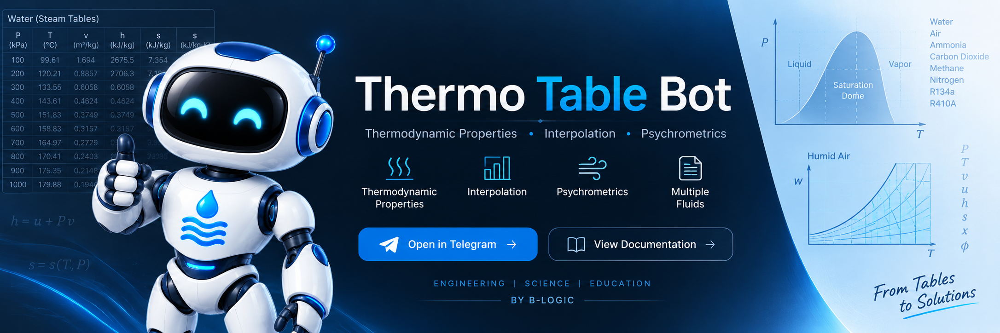

  

<h1 align="center">Thermo Table Bot</h1>

  <strong>Thermodynamic property evaluation, interpolation and psychrometric calculations — directly in Telegram.</strong>

  A scientific thermodynamics and psychrometrics tool by <strong>B-Logic</strong>.

  <a href="https://t.me/thermo_table_bot"><strong>Open in Telegram</strong></a>
  &nbsp;&nbsp;•&nbsp;&nbsp;
  <a href="./docs/overview.md"><strong>Documentation</strong></a>
  &nbsp;&nbsp;•&nbsp;&nbsp;
  <a href="https://b-logic.me/"><strong>B-Logic</strong></a>

  
  
  
  

> **Public documentation repository**  
> The production source code, internal scientific datasets and deployment infrastructure of Thermo Table Bot are not publicly released.

---

## Overview

Thermo Table Bot is designed to automate the repetitive numerical work involved in thermodynamic property evaluation while keeping the user focused on the engineering problem itself.

Instead of manually navigating multiple property tables, identifying the correct thermodynamic region and repeatedly performing interpolation, users can provide supported state information and let the system handle the property-evaluation workflow.

The project combines a Telegram interface with thermodynamic and psychrometric calculation systems, structured scientific data, region detection, interpolation and scientific validation.

---

## What can it do?

Thermo Table Bot supports:

- Thermodynamic property evaluation
- Automatic thermodynamic region detection
- One-dimensional interpolation
- Two-dimensional interpolation
- Saturation-state calculations
- Two-phase liquid-vapor calculations
- Vapor-quality calculations
- Refrigerant property calculations
- Engineering-gas property calculations
- Humid-air psychrometric calculations
- Scientific input validation
- Physical consistency checking
- Reference and calculation-method reporting

---

## Supported properties

Depending on the selected substance and thermodynamic state, the system works with properties such as:

| Symbol | Property |
|---|---|
| `P` | Pressure |
| `T` | Temperature |
| `v` | Specific volume |
| `u` | Specific internal energy |
| `h` | Specific enthalpy |
| `s` | Specific entropy |
| `x` | Vapor quality |

Detailed definitions are available in [Thermodynamic Properties](./docs/thermodynamic-properties.md).

---

## Supported substances

Thermo Table Bot currently supports thermodynamic calculations for:

| Substance | Category |
|---|---|
| Water | Pure substance |
| Air | Engineering gas |
| Ammonia | Refrigerant / thermodynamic fluid |
| Carbon dioxide | Engineering gas |
| Methane | Engineering gas |
| Nitrogen | Engineering gas |
| R134a | Refrigerant |
| R410A | Refrigerant |

Humid-air calculations are handled through the dedicated psychrometric system.

See [Supported Fluids](./docs/supported-fluids.md) for additional details.

---

## How it works

A typical thermodynamic calculation follows this workflow:

    Select calculation type
              ↓
       Select substance
              ↓
    Select known properties
              ↓
        Enter values
              ↓
      Validate inputs
              ↓
       Detect region
              ↓
    Select scientific data
              ↓
    Lookup or interpolation
              ↓
    Calculate remaining properties
              ↓
     Consistency checks
              ↓
           Result

The exact path depends on the substance, input-property pair and thermodynamic region.

Read the complete workflow in [How It Works](./docs/how-it-works.md).

---

## Automatic region detection

For fluids with liquid-vapor phase behavior, the system determines the relevant physical region before selecting the calculation method.

Supported state classifications may include:

- Compressed liquid
- Saturated liquid
- Two-phase liquid-vapor mixture
- Saturated vapor
- Superheated vapor

Correct region detection prevents property data from different physical regions from being treated as interchangeable.

Learn more in [Region Detection](./docs/region-detection.md).

---

## Interpolation

Engineering states frequently fall between available property-data points.

Thermo Table Bot supports:

- **One-dimensional interpolation**
- **Two-dimensional interpolation**

where applicable.

Exact available data points can be retrieved directly without unnecessary interpolation, while states outside supported data ranges are not automatically treated as valid interpolation cases.

See [Interpolation](./docs/interpolation.md).

---

## Psychrometrics

Thermo Table Bot includes a dedicated humid-air calculation system.

Supported psychrometric quantities include properties such as:

- Dry-bulb temperature
- Wet-bulb temperature
- Dew-point temperature
- Relative humidity
- Humidity ratio
- Enthalpy

Different supported pairs of known humid-air properties can be used to determine the remaining state information.

See [Psychrometrics](./docs/psychrometrics.md).

---

## Validation

Thermo Table Bot is developed as scientific software, with testing extending beyond the Telegram interface.

The validated project snapshot documented in this repository reported:

| Validation category | Result |
|---|---:|
| Automated test suite | **412 passed** |
| Thermodynamic regression cases | **118 / 118 passed** |
| Psychrometric pair evaluations | **14,000 / 14,000 passed** |
| Stress-test cases | **10,000 / 10,000 passed** |
| Scientific invariant failures | **0** |

These results provide evidence for the tested project snapshot. They should not be interpreted as a guarantee that every possible state, input or future version is error-free.

Read the validation methodology and scope in [Validation](./docs/validation.md).

---

## Documentation

The technical documentation is organized in the [`docs`](./docs) directory.

| Document | Description |
|---|---|
| [Project Overview](./docs/overview.md) | Project purpose, capabilities and scientific scope |
| [How It Works](./docs/how-it-works.md) | Architecture and calculation workflow |
| [Supported Fluids](./docs/supported-fluids.md) | Supported substances and calculation scope |
| [Thermodynamic Properties](./docs/thermodynamic-properties.md) | Property definitions and state variables |
| [Region Detection](./docs/region-detection.md) | Thermodynamic state classification |
| [Interpolation](./docs/interpolation.md) | One-dimensional and two-dimensional interpolation |
| [Psychrometrics](./docs/psychrometrics.md) | Humid-air property calculations |
| [Examples](./docs/examples.md) | Representative calculation workflows |
| [Validation](./docs/validation.md) | Testing and scientific validation |
| [Limitations](./docs/limitations.md) | Scientific and numerical boundaries |
| [FAQ](./docs/faq.md) | Frequently asked questions |

---

## Examples

The documentation contains representative workflows covering topics such as:

- Water property calculations
- Superheated states
- Saturated liquid and vapor
- Two-phase mixtures
- Vapor quality
- Refrigerants
- Engineering gases
- One-dimensional interpolation
- Two-dimensional interpolation
- Psychrometric calculations
- Invalid and unsupported states

See [Examples](./docs/examples.md).

---

## Design philosophy

Thermo Table Bot is not intended to replace learning thermodynamics.

Understanding thermodynamic states, phase behavior, property tables, interpolation and psychrometric relationships remains essential.

The project is designed around a simpler idea:

**Learn the method. Understand the physics. Automate the repetitive property evaluation.**

The tool handles repetitive numerical work so the user can return to the engineering analysis.

---

## Scientific scope

Thermo Table Bot evaluates thermodynamic and psychrometric properties within its documented scientific scope.

It is not a complete simulator for engineering equipment, thermodynamic cycles, CFD, heat transfer or other multiphysics systems.

Users remain responsible for:

- Selecting the correct physical model
- Using consistent units
- Interpreting the thermodynamic state
- Checking physical plausibility
- Applying the calculated properties correctly
- Independently verifying results when required by the application

See [Limitations](./docs/limitations.md).

---

## Source code

The production source code is proprietary and is not included in this repository.

The following remain private:

- Production application source code
- Internal scientific datasets
- Complete internal test suite
- Exact numerical tolerances
- Internal fallback logic
- Server configuration
- Deployment infrastructure
- Security-sensitive operational information

This repository is intended for:

- Technical documentation
- Scientific methodology
- Validation evidence
- Usage examples
- Project information

---

## Project status

**Stable / Feature-complete**

Thermo Table Bot reached its intended final feature set with version `1.0.0`, released on **September 9, 2026**.

No additional product features are currently planned.

Future updates, if required, will focus on maintenance, scientific corrections, reliability, compatibility and documentation rather than feature expansion.

See [CHANGELOG.md](./CHANGELOG.md) for the public release history.

---

## Use Thermo Table Bot

**Telegram:**  
https://t.me/thermo_table_bot

**B-Logic:**  
https://b-logic.me/

---

## B-Logic

Thermo Table Bot is developed as part of **B-Logic**, an educational and scientific software project focused on mathematics, physics and engineering tools.

For project information and educational content:

https://b-logic.me/
